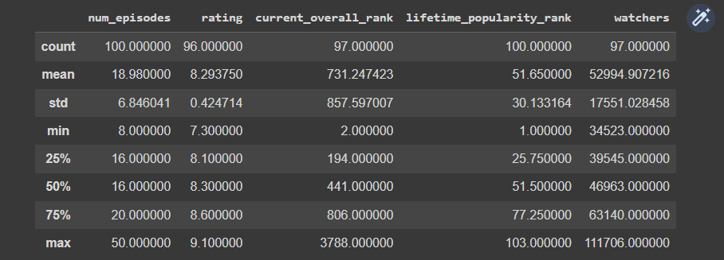
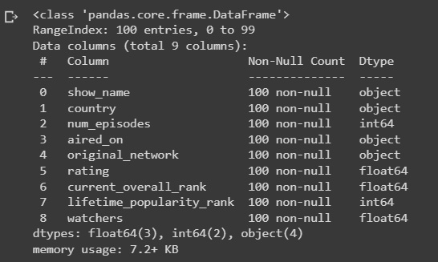

# Ex-01_DS_Data_Cleansing
# AIM
To read the given data and perform data cleaning and save the cleaned data to a file.

# Explanation
Data cleaning is the process of preparing data for analysis by removing or modifying data that is incorrect ,incompleted , irrelevant , duplicated or improperly formatted. Data cleaning is not simply about erasing data ,but rather finding a way to maximize datasets accuracy without necessarily deleting the information.

# ALGORITHM
## STEP 1
Read the given Data

## STEP 2
Get the information about the data

## STEP 3
Remove the null values from the data

## STEP 4
Save the Clean data to the file

# CODE
```python
Program Developed By : Mukil kumar v

Register number : 212222230087

import pandas as pd

import numpy as np

import seaborn as sns

data=pd.read_csv("Data_set.csv")

data

data.head()

data.describe()

data.info()

data.tail()

data.shape

data.columns

data.isnull().sum()

data.duplicated()


data['show_name'] = data['show_name'].fillna(data['show_name'].mode()[0])

data['aired_on'] = data['aired_on'].fillna(data['aired_on'].mode()[0])

data['original_network'] = data['original_network'].fillna(data['original_network'].mode()[0])

sns.boxplot(x="rating",data=data)

data['rating'] = data['rating'].fillna(data['rating'].mean())

data['current_overall_rank'] = data['current_overall_rank'].fillna(data['current_overall_rank'].mean())

data['watchers'] = data['watchers'].fillna(data['watchers'].mean())

data.isnull().sum()

data.info()
```
# OUPUT
## Dataset:


## Head:


## Describe:


## Pre-cleaning information:


## TAIL:


## SHAPE:


## COLOUMN:


## PRE-CLEANING SUM:


## DUPLICATE:


## SNS PLOT:


## POST-CLEANING SUM:


## POST CLEANING INFORMATION:


# Result:
The given data is read and data cleaning is performed and the cleaned data is saved to a file.


